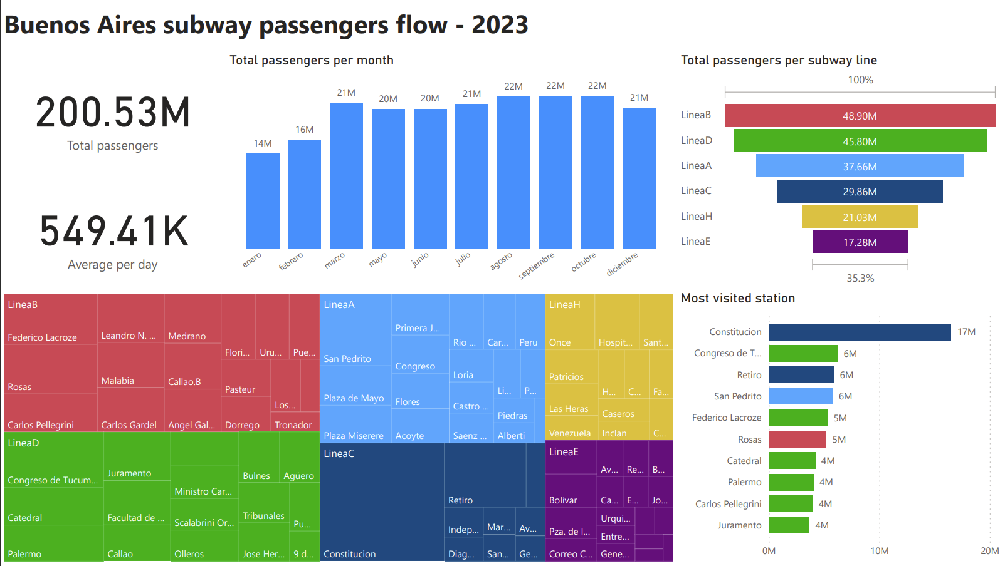

# Buenos Aires passengers flow

This is a project to create a data pipeline that extracts data from a dataset, transforms it and loads it into a data warehouse. The data is then visualized using PowerBI. It was done as a final project for the Data Engineering course at DataTalksClub. 

This project is a demostration of how to use Apache Airflow, Terraform, Google Cloud Storage, Google BigQuery and PowerBI to create a data pipeline. It can be greatly improved but should suffice as a proof of skills. :)

dataset: https://data.buenosaires.gob.ar/dataset/subte-viajes-molinetes/resource/8d752670-38d0-49f6-b6df-0d9948c5e993

## Dataset Description

Number of passengers per turnstile at each station in 15-minute ranges and discriminating according to the type of ticket for the year 2023 in Buenos Aires, Argentina.

## What it does

The data pipeline extracts the data from the dataset, transforms it to a more suitable format and loads it partitioned into a data warehouse. The data is then modeled using dbt and visualized using PowerBI.

## Technologies used

**Python** - Programming language

**Docker** - Containerization

**Terraform** - Infrastructure as code

**Apache Airflow** - Data pipeline orchestration

**Google Cloud Storage** - Data storage

**Google BigQuery** - Data warehouse

**Dbt** - Data modeling

**PowerBI** - Data visualization

## How to run

1. Clone the repository
2. Run `docker-compose up` to start the Airflow server
3. Access `localhost:8080` to access the Airflow UI with `airflow:airflow` as user/password
4. Modify terraform files to set up the infrastructure as needed
5. Run `terraform init` to initialize the terraform project
6. Run `terraform apply` to create the infrastructure
7. Trigger the `caba_etl` DAG
8. Access the BigQuery console and create a new external table named `data` based on the partitioned data in GCS
9. Using `dbt`, build the model
10. Data is ready to be used in PowerBI or similar tools

## Tips

- GCS service account key file required. Needs to be placed inside ./airflow/tmp folder with name "key.json".

- The final PowerBI  report is available in the `reports` folder in PDF format. Source `pbix` is also provided. 

## Report
